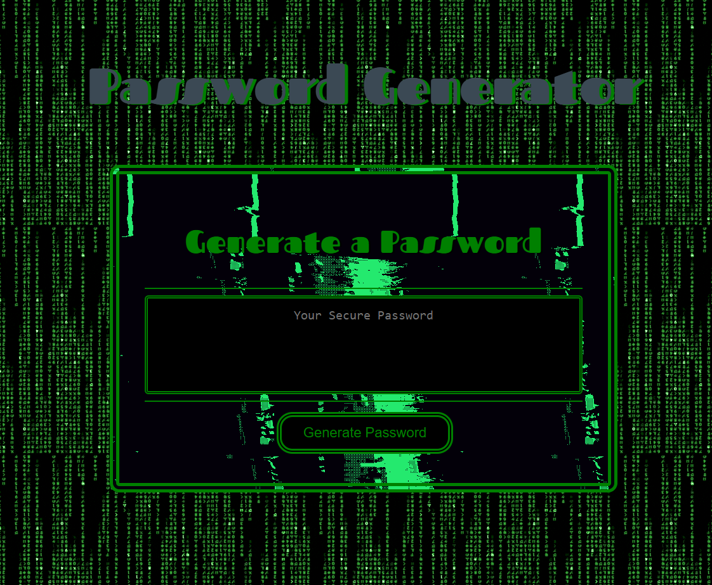
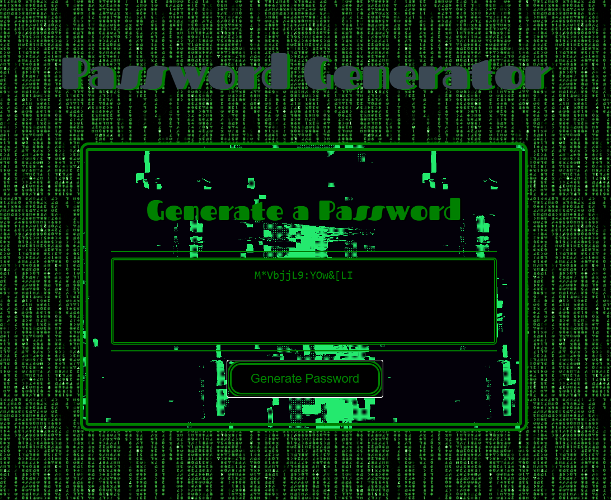

# Password Generator

## Description
This password generator creates a random password with a user  
selected length of 8 to 128 characters. The user is able to  
choose which types of characters they would like to include  
in their password: lower case, upper case, special characters  
and/or numbers. To create a password simply click the generate  
password button and follow the prompts.

  
This is how the password generator should look when loaded

## Usage
The password is simple to use, just click the button and you will  
receive the following input requests:
* input a number greater than or equal to 8 and less than or equal to 128  
this will be the length of your password  
* next you will receive a series of confirmations to select which  
types characters you would like to include in your password  
click ok for yes or click cancel for no
* after you have completed these tasks the password generator will  
return a randomly generated password meeting your specified requirements  
in the box  
__*Please note, you should refresh the page in your browser after you  
have generated your password before generating a new password, this  
ensures that your new specifications will be followed, if you do  
not refresh the characters you included in your last generated password  
will be included in your new password*__  

  
This is how the password generator will look after returning a password

## Link 
https://millerrich.github.io/password-generator/
